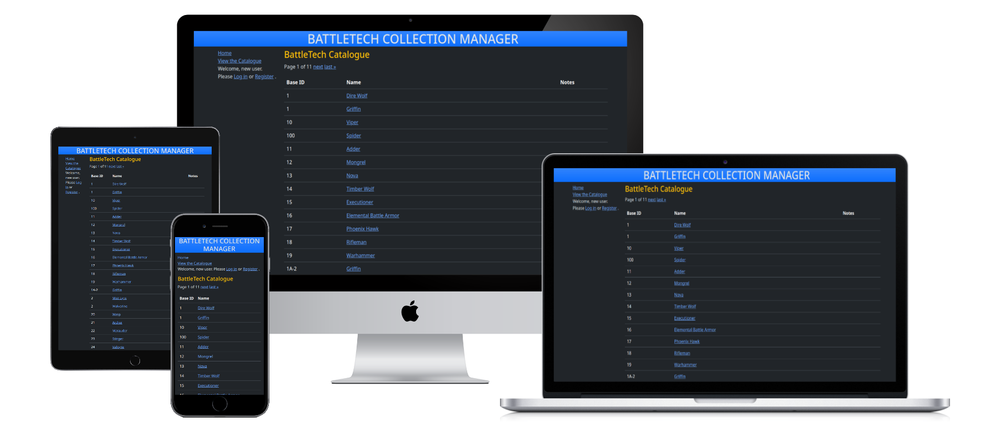
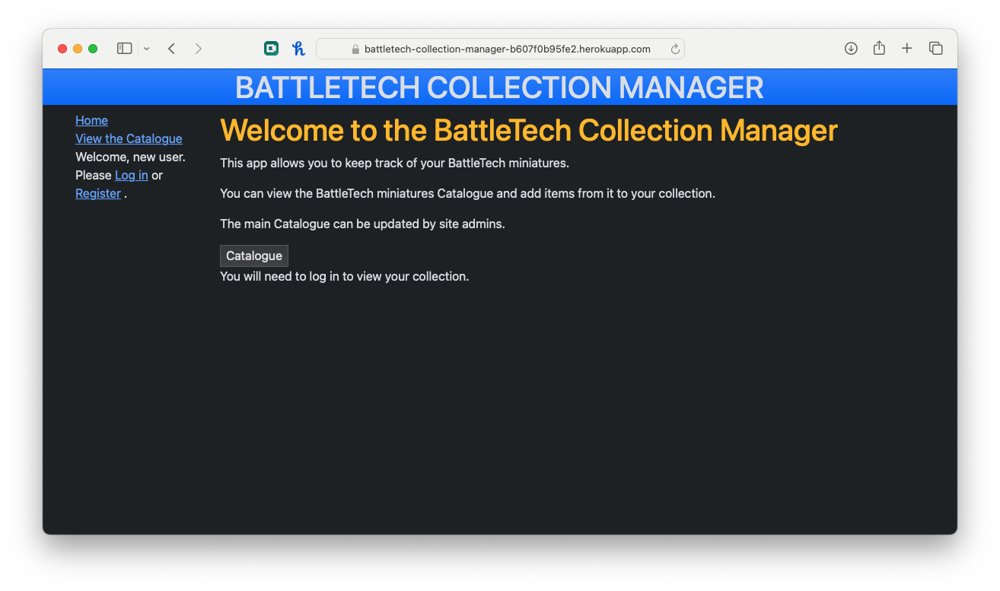
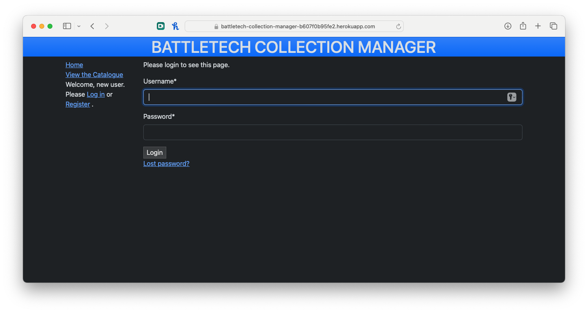
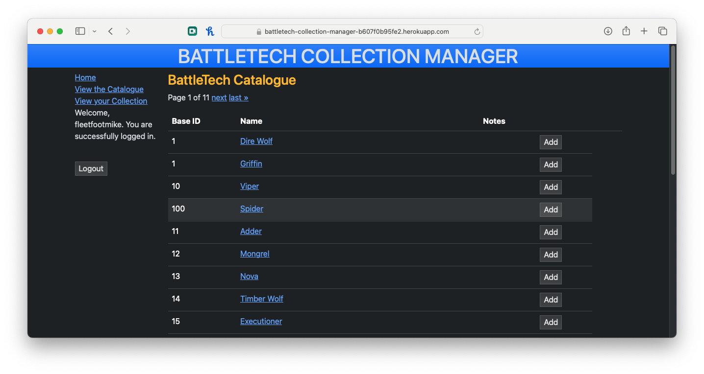
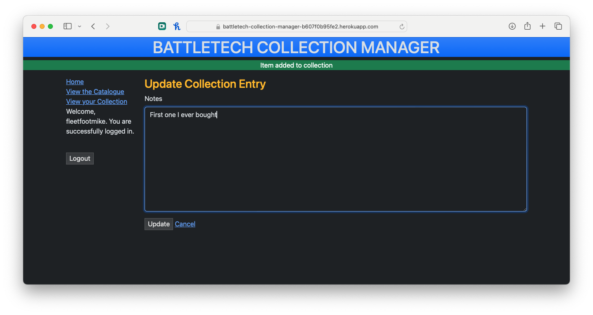
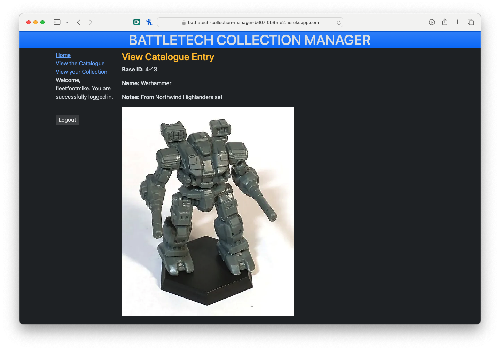
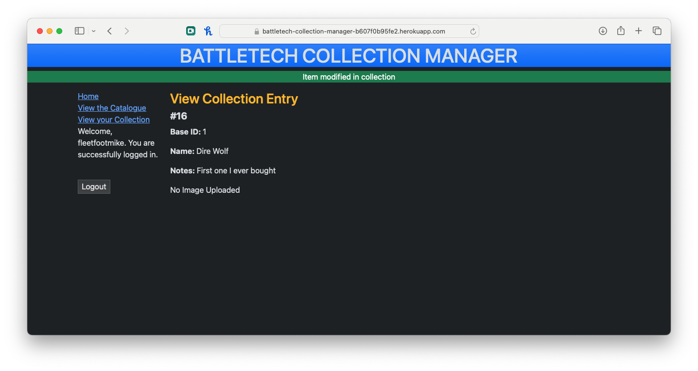

# BattleTech Collection Manager

Portfolio 4 project as part of the Diploma in Full Stack Software Development by Code Institute.

---

BattleTech Collection Manager (BTCM) is a website that lets users manage their collection of miniatures for the BattleTech boardgame.

It is a fullstack web application that allows users to browse the current catalogue of available miniatures, and create an account in order to manage their own collection. User with the appropriate permissions can add new items to the catalogue when they are released.

Link to live site: [https://battletech-collection-manager-b607f0b95fe2.herokuapp.com](https://battletech-collection-manager-b607f0b95fe2.herokuapp.com)

___

## Site Objectives

Design and create a web application to demonstrate an increasing understanding of the libraries and frameworks available to developers.

My three main objectives were:

- ### Create a readable, clean and responsive front end

  I wanted to make the site easily accessible and intuitively navigated for the users. Django and Bootstrap were used to create and style the front end.

- ### Make use of available backend functionality

  The use of the backend framework allows users to create a profile, add, edit, and delete miniatures from their collection.

- ### Store data on an external cloud database

  I used NeonDB to store the PostgreSQL database for this project.

___

# User Experience/UX

## Target Audience

- Players of the BattleTech boardgame that are interested in keeping a record of their miniatures collection.

## User Stories

### New Visitor Goals

- To understand what the site and content is about.
- How to navigate the site.
- Create an account and engage with the site and start a collection.

### Existing Visitor Goals

- Log in and out of their account.
- View their collection and make updates to it.
- As a Catalogue Manager: keep the Catalogue up to date with new product releases.

# Design

## Wireframes

# Data model
### Catalogue
- Base ID: CharField(6)
    - Represents the ID moulded on the base of the miniature
    - Is not unique (There are different miniatures with the same Base ID)
    - Is validated against a pattern which matches all known Base ID formats
- Name: CharField(255)
    - Name of the miniature
- Notes: TextField(can be Null/Blank)
    - Extra information 
- Image: ImageField(can be Null/Blank)
    - An image of the miniature
    - Is required to be less than 500KB

### Collection
- Owner: User
    - From django.contrib.auth.models
- Mini: Catalogue
    - References the Catalogue model
    - It is possible for users to own multiple copies of the same miniature
- Notes: TextField(can be Null/Blank)
    - Extra information

### Authentication/Authorisation 
- Uses django.contrib.auth.models User and Group
    - Users with permission to modify the Catalogue are in the 'Catalogue Managers' group, and must be added via the django admin page by a SuperUser.

# Features

## Existing Features

Homepage with explaination of site with links

The user can log in and register an account

Miniatures Catalogue with the ability to add to collection
As a Catalogue Manager: add, edit, or delete entries from the catalogue

View collection with the ability to edit or delete items from it

Detailed view of item in catalogue or collection

## Future Features

- Allow the user to add images of items to their collection
- Allow the user to search the catalogue/their collection for a specific miniature by name or base ID
- Allow the user to define a paint scheme (including notes on which paints were used etc...) and apply it to an item in their collection

# Technologies Used

Here are the technologies used to build this project:

- [Gitpod](https://gitpod.io/) To build and create this project
- [Github](https://github.com) To host and store the data for the site.
- [PEP8 Validator](https://pep8ci.herokuapp.com/) Used to check python code for errors
- [NeonDB](https://www.neon.tech/) Used to store PostgreSQL database.
- [Heroku](https://id.heroku.com/) Used to deploy the project

# Programming Languages, Frameworks and Libraries Used

- [HTML](https://developer.mozilla.org/en-US/docs/Web/HTML)
- [CSS](https://developer.mozilla.org/en-US/docs/Learn/Getting_started_with_the_web/CSS_basics)
- [Python](https://en.wikipedia.org/wiki/Python_(programming_language))
- [Django](https://www.djangoproject.com/)
- [Bootstrap](https://getbootstrap.com/)
- [CrispyForms](https://django-crispy-forms.readthedocs.io/)
- [Crispy-Boostrap](https://pypi.org/project/crispy-bootstrap5/)
- [Whitenoise](https://whitenoise.readthedocs.io/)
- [Pillow](https://pypi.org/project/pillow/)

# Agile

This project was designed using Agile methodology, utilising the Project Board and Issues sections in GitHub

- [Project Board](https://github.com/users/Jamzieeeee/projects/3/views/1)

# Testing 

## Manual Testing

### As User
| TEST | OUTCOME | PASS/FAIL|
|:---:|:---:|:---:|
| Can create an account | Created successfully | Pass |
| Can log in | Logged in successfully | Pass |
| Can log out | Logged out successfully, but logging in again straight from the logout page takes you back to the logout page | Fail(1) |
| See different homepage when logged in | Page loaded correctly | Pass |
| Can view catalogue | Page loaded correctly | Pass |
| Can add item to collection | Item added successfully | Pass |
| Can view collection | Page loaded correctly | Pass |
| Can edit item in collection | Item edited successfully | Pass |
| Can delete item in collection | Item deleted successfully | Pass |
| Cannot access catalogue management | Access denied | Pass |

(1) The next url passed to the login page needs not to be set when on the logout page

### As Catalogue Manager
| TEST | OUTCOME | PASS/FAIL |
|:---:|:---:|:---:|
| Can view catalogue management controls | Create, edit, and delete visible | Pass |
| Can add item to catalogue | Item added successfully | Pass |
| Can edit item in catalogue | Item edited successfully | Pass |
| Can delete item in catalogue | Item deleted successfully | Pass |

## Validator Testing 

### Lighthouse
Testing the full Catalogue page which contains all current 253 known BattleTech miniatures.

### HTML/CSS

### Python
Python pep8 validation was done via [Code Institute's Python Linter](https://pep8ci.herokuapp.com/)

A number of errors and whitespace issues were found and rectified. The linter does not seem to handle escape characters in regular expression correctly (models.py, line: 11)

Python Files Tested:

- models
- forms
- views
- urls

## Unfixed Bugs

# Deployment

# Credits 

## Content 

## Media